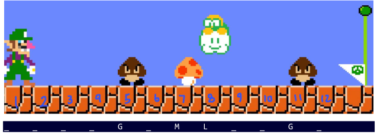
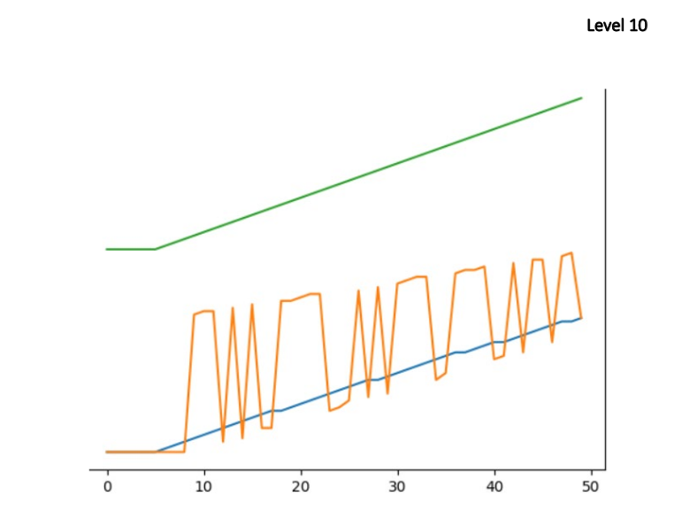
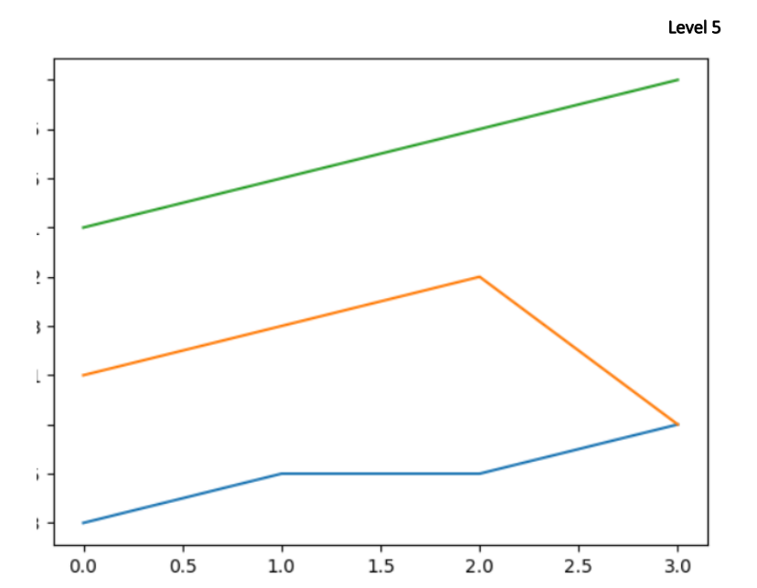
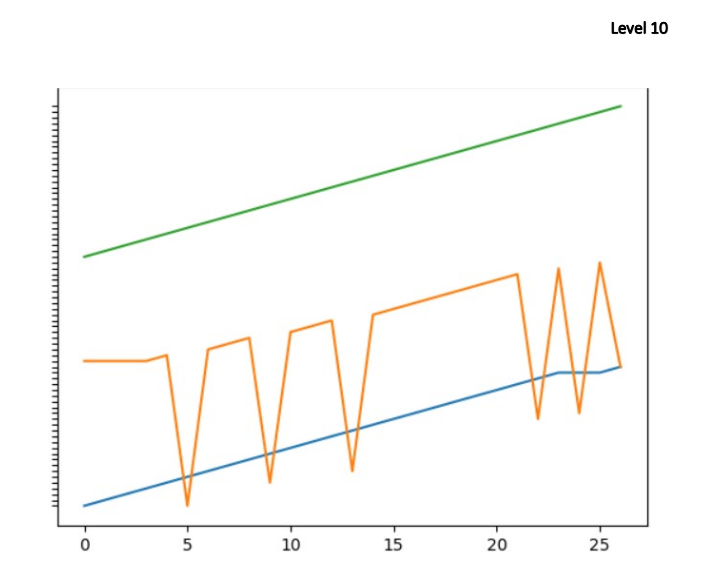
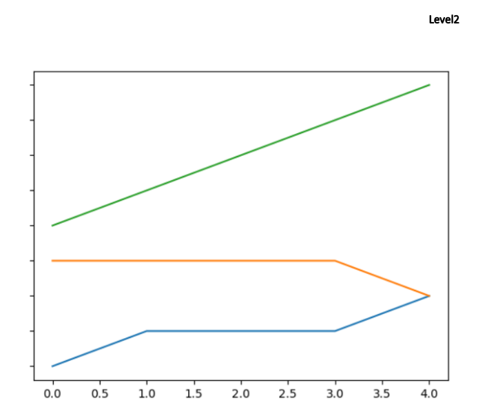

This is a simulation of super mario game using Genetic algorithms.

**Symbols;**
* **"G"**; means the Goomba
* **"L"**; means the Lukitu
* **"M"**; means a mushroom (point)

In each level we have a string which contains characters. For example "_" means blank place, "G", "L", "M" that we mentioned prior.
Luigi starts at the first letter from left and must reach the end.(Strings are available in the _../attachments/levels_ directory) 
you can see an example below;  

To get the optimal score, agent doesn't need to move to the left. So it always moves to the right and is able to do these three movements;
* moving to the right; 0
* jumping and moving to the right; 1
* bending down and moving to the right; 2

Here are some results: [Green for Highest, Orange for Average and Blue for Lowest]

**_At the Level 10; With 200 initial population and 0.1 mutation_**

**_At the level 5_**

**_At the level 10 with same population as before but with 0.5 mutation_**

**_At the level 2_**

